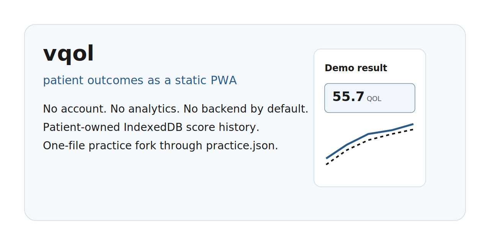

# vqol

Patient-owned VEINES-QOL/Sym tracking for vein and vascular care.



vqol is a static, installable PWA that helps patients record longitudinal venous-disease quality-of-life scores and export a clinician-ready report. It is designed for fork-and-deploy use by vein practices: edit `public/practice.json`, deploy to GitHub Pages or Cloudflare Pages, and keep patient data local by default.

> Instrument note: the app currently ships with placeholder VEINES-QOL/Sym item text and placeholder normative constants while LSHTM permission is pending. Read [INSTRUMENT-LICENSE.md](INSTRUMENT-LICENSE.md) before publishing a public deployment.

## Current Status

The working app includes:

- One-question-per-screen survey flow with draft resume support.
- Local IndexedDB storage for sessions, scores, and app metadata.
- VEINES-QOL/Sym scoring-engine shape with placeholder constants.
- Practice branding through `public/practice.json`.
- Four locale files: English, Spanish, French, German.
- Longitudinal uPlot chart on the results screen.
- Print/PDF export through `window.print()` and print CSS.
- Seeded fake-data demo at `#/results?demo=1`.
- Curiosity lab, Outcomes Studio, Practice Forge, Launch Kit, local-first proof panel, one-file fork audit, and QR poster route.
- Follow-up calendar export with local `.ics` generation.
- Follow-up reminder scheduling helpers and in-app reminder banner.
- PWA manifest, icons, service worker, and install prompt.
- Service-worker update prompt so returning visitors can refresh into new routes without losing an active survey.
- Optional aggregate submission module, disabled by default.

Remaining launch blockers:

- Send and resolve the LSHTM licensing inquiry, or ship reference-only mode.
- Add final deployed screenshots/GIF/social preview after Pages is live.
- Run real-device PDF/PWA testing on iOS Safari and Android Chrome.

Live demo:

- https://byteworthyllc.github.io/vqol/
- https://byteworthyllc.github.io/vqol/#/results?demo=1

## Why This Is Technically Interesting

vqol is meant to be inspected as much as used:

- A clinical-adjacent outcomes workflow with static files only.
- Patient-owned score history in browser IndexedDB.
- No account system, backend, analytics, or telemetry.
- A clinic-branded fork through one JSON file.
- An explicit legal-safe path when instrument text cannot be redistributed.
- A falsifiable proof surface for offline behavior, telemetry absence, and fork readiness.

The project should spread through those constraints and proofs, not through growth copy.

## Quick Start

```bash
npm install
npm run dev
```

Open the Vite URL, usually `http://localhost:5173`.

See [FAQ.md](FAQ.md) for common deployment and product-scope questions.

## Practice Setup

Edit only:

```text
public/practice.json
```

The config controls:

- Practice name
- Logo path
- Contact details
- Brand colors
- Available locales
- Aggregate submission feature flags

Validate the config and translations:

```bash
npm run check
```

## Verification

Run the full local gate:

```bash
npm run verify
```

This runs:

- `svelte-check`
- contrast validation
- translation key validation
- Vitest
- production build
- telemetry signature audit

## Project Structure

```text
src/
  lib/
    chart/             uPlot trend chart
    aggregate/         optional de-identified aggregate submission
    calendar/          follow-up .ics export
    demo/              deterministic fake score histories
    download/          client-side file download helper
    forge/             practice.json draft and serialization helpers
    fork/              one-file fork readiness audit
    i18n/              locale loading and translation helper
    marketing/         launch artifact, AI citation, and remix brief generator
    notifications/     reminder scheduling and notification helpers
    offline/           runtime offline-readiness inspection
    pdf/               print/PDF export helper
    practice-config/   practice.json validation and branding
    scoring/           item metadata, constants, scoring algorithm
    storage/           IndexedDB wrapper
    survey/            survey item metadata
  routes/              Home, Survey, Results, supporting route components
messages/              en/es/fr/de message files
public/                practice.json and PWA icons
scripts/               validation and audit scripts
.planning/             GSD planning state, phase summaries, codebase map
docs/                  public operator docs
```

## Privacy Model

By default, vqol has no backend, accounts, telemetry, or third-party analytics. Patient data is stored in the user's browser through IndexedDB. Export is patient-initiated through the browser print dialog.

Optional aggregate submission is implemented but off by default. When enabled, it posts a de-identified score payload only to the configured HTTPS practice endpoint.

## Curiosity Lab

Useful fake-data and proof routes:

- `#/lab` - tool index
- `#/studio` - synthetic cohort and protocol workbench
- `#/forge` - live `practice.json` builder
- `#/launch` - viral functionality and marketing artifact generator
- `#/results?demo=1` - seeded fake longitudinal result
- `#/proof` - local-first and telemetry proof panel
- `#/fork` - one-file `practice.json` fork audit
- `#/poster` - printable waiting-room QR poster

See [docs/CURIOSITY-LAB.md](docs/CURIOSITY-LAB.md), [docs/OUTCOMES-STUDIO.md](docs/OUTCOMES-STUDIO.md), [docs/PRACTICE-FORGE.md](docs/PRACTICE-FORGE.md), [docs/VIRALITY-PLAYBOOK.md](docs/VIRALITY-PLAYBOOK.md), [docs/INSTRUMENT-MODES.md](docs/INSTRUMENT-MODES.md), and [docs/AGGREGATE-SUBMISSION.md](docs/AGGREGATE-SUBMISSION.md).

## What This Is Not

vqol is not clinical advice, diagnosis, severity interpretation, or an EHR integration. It displays scores, deltas, history, and export controls only.

## License

The application code is MIT licensed. VEINES-QOL/Sym item text, validated translations, and normative scoring constants are separate instrument content and are not covered by this repository's MIT license unless permission is granted by the instrument rights holder.
